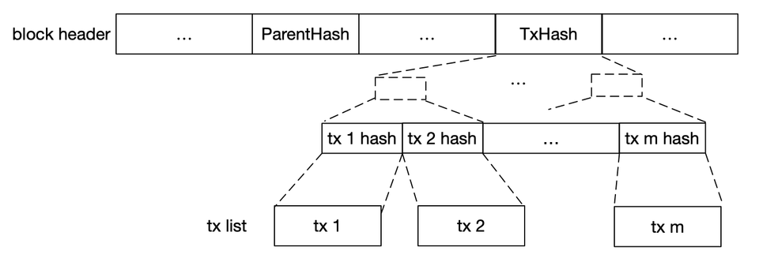

# Block, Chain and Consensus

## Hash

**Explanation**: The principle of hashing is to convert input of any length into output of fixed length through the hash algorithm.

**Characteristic**: the same input will definitely get the same output, therefore different inputs will most likely get different outputs.

**Example**: use `md5sum` in the shell command line to calculate the MD5 hash of any charater.

```sh
$ md5sum <<< haha
7494ab07987ba112bd5c4f9857ccfb3f  -
$ md5sum <<< hehe
e4439267203fb5277d347e6cd6e440b5  -
$ md5sum <<< hhhhhhhhhhhhhhhhhhhhhhhhhhhhhhhhhhhhhhhhhhhhhhhh
6f2362c812dcfd693da2e3ae537cfb4
```

**Hash algorithms**:

* File tamper-proof: MD5
* Bitcoin mining: SHA256
* Data fragment proof: Merkle root
* Text deduplication: SimHash

## Block

A block is composed of a block header and a transaction list (tx list). Blocks are linked together into a chain structure through the hash of the block header.

#### Block header

Bitcoin's block header&#x20;

```cpp
int32_t nVersion; 
uint256 hashPrevBlock; 
uint256 hashMerkleRoot; 
uint32_t nTime; 
uint32_t nBits; 
uint32_t nNonce;
```

Ethereum's block header

```solidity
ParentHash  common.Hash    `json:"parentHash"       gencodec:"required"`
UncleHash   common.Hash    `json:"sha3Uncles"       gencodec:"required"`
Coinbase    common.Address `json:"miner"            gencodec:"required"`
Root        common.Hash    `json:"stateRoot"        gencodec:"required"`
TxHash      common.Hash    `json:"transactionsRoot" gencodec:"required"`
ReceiptHash common.Hash    `json:"receiptsRoot"     gencodec:"required"`
Bloom       Bloom          `json:"logsBloom"        gencodec:"required"`
Difficulty  *big.Int       `json:"difficulty"       gencodec:"required"`
Number      *big.Int       `json:"number"           gencodec:"required"`
GasLimit    uint64         `json:"gasLimit"         gencodec:"required"`
GasUsed     uint64         `json:"gasUsed"          gencodec:"required"`
Time        uint64         `json:"timestamp"        gencodec:"required"`
Extra       []byte         `json:"extraData"        gencodec:"required"`
MixDigest   common.Hash    `json:"mixHash"`
Nonce       BlockNonce     `json:"nonce"`


// BaseFee was added by EIP-1559 and is ignored in legacy headers.
BaseFee *big.Int `json:"baseFeePerGas" rlp:"optional"`
```

Currently, we only focus on two of the fields:

1. `hashPrevBlock` /`ParentHash`，hash of previous block header
2. `hashMerkleRoot`/`TxHash`，hash of tx list

#### Block body

<figure><figcaption><p>The block body is the tx list</p></figcaption></figure>

1. The block body is the tx list, and the block header points to the unique tx list through `TxHash`.
2. The hash algorithm used to obtain `TxHash` from the tx hash list is called a Merkle tree, which has special properties compared to other hash algorithms (it can succinctly prove the existence of a tx within it).

## Chain

<figure><figcaption><p>Form of a chain</p></figcaption></figure>
